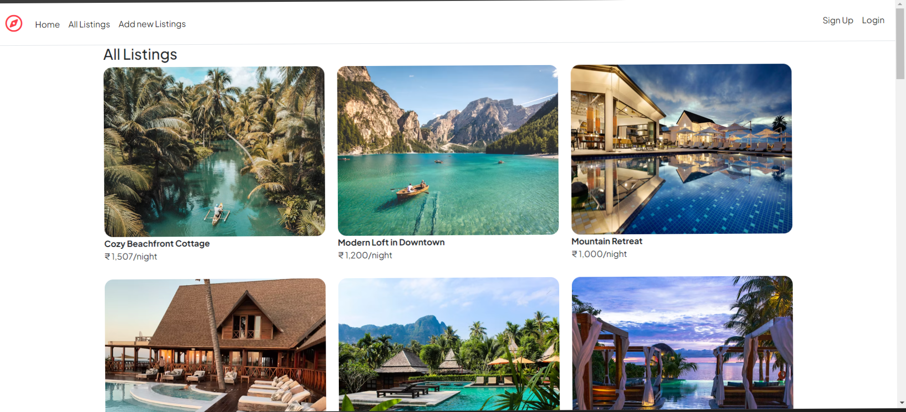
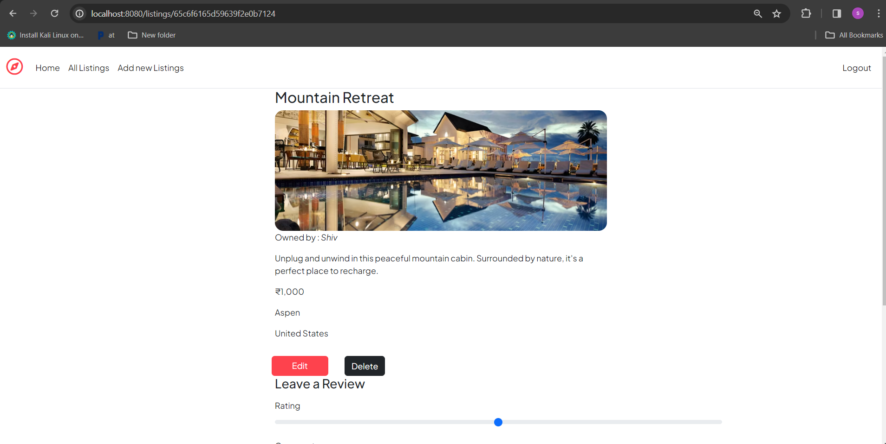
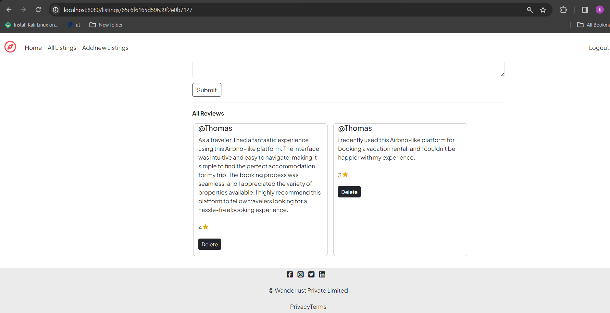
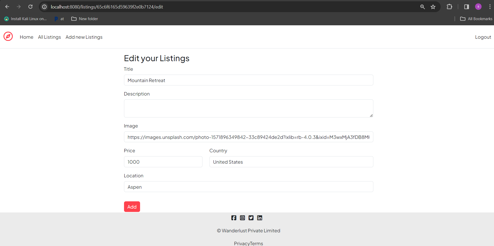
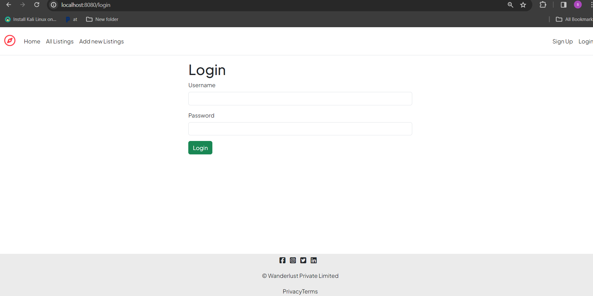

# Wanderlust

This project is a basic version of Airbnb, allowing users to list properties for rent and travelers to search and book accommodations.

## Features

- User Registration and Authentication: Users can create accounts and log in securely.

- Listing Management: Hosts can add, edit, and delete property listings, including details such as property type, location, amenities, and pricing.

- Search and Filters: Travelers can search for accommodations based on location, dates, property type, and other filters.
- Booking System: Travelers can view property availability and book accommodations for specific dates.
- Messaging: Hosts and travelers can communicate with each other through a messaging system to discuss bookings and accommodations.
- Reviews and Ratings: Users can leave reviews and ratings for properties they've stayed in, helping other travelers make informed decisions.

## Technologies Used
-  Frontend:  HTML, CSS, JavaScript, EJS.
- Backend:   Node.js, Express.js, MongoDB.
- Authentication: Authentication method used, Password.
- Database: Database management system used, MongoDB.

## Installation
- Clone the repository: git clone <repository-url>
- Navigate to the project directory: cd airbnb-like
- Install dependencies: npm install
- Start the development server: npm start
- Access the application in your web browser at http://localhost:8080/listings

## Contributing

Contributions are welcome! If you'd like to contribute to the project, please follow these steps:

- Fork the repository.
- Create a new branch for your feature: git checkout -b feature-name
- Make your changes and commit them: git commit -m 'Add new feature'
- Push to the branch: git push origin feature-name
- Submit a pull request.

